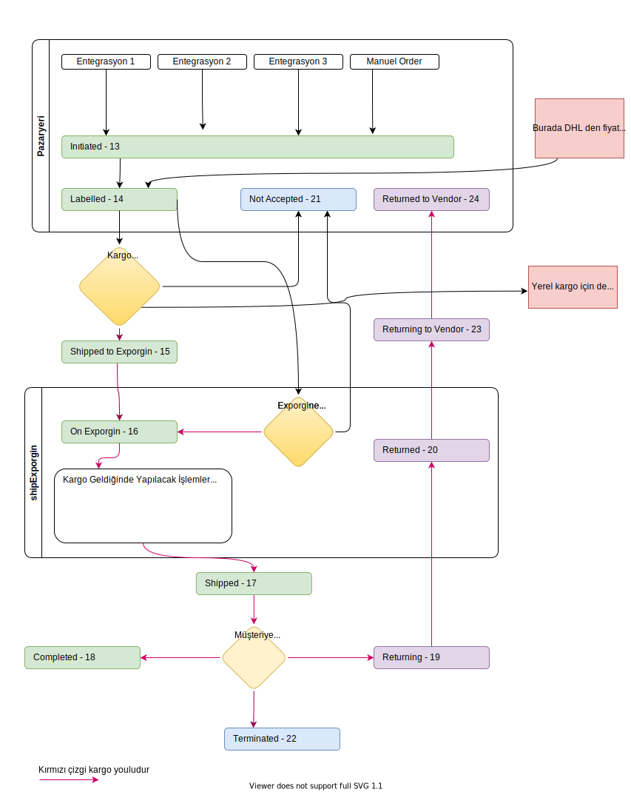

# INSTALL
### Dependencies

Nginx 1.19.10

PHP 8.0.17

MySQL 5.7.33

### Install

Aşağıdaki koöut girilip adımlar takip edilebilir.
```cmd
php artisan install
```
### Manuel Install

1 - composer update

2 - npm install

3 - php artisan db:wipe

4 - php artisan migrate

5 - npm run dev

# MODAL FORM VIEW

data-id="" boş bırakılmışsa yeni ekler.

###Vendor sayfası
```html
<button class="btn btn-primary open_form" data-target="view_name"  data-template="{{ vendorTheme() }}" data-id=""  type="button">Button</button>

<!-- // Html elemanı button olmak zorunda değil. -->

<a class="btn btn-primary open_form" data-target="view_name"  data-template="{{ vendorTheme() }}" data-id=""  type="button">Button</a>

<span class="btn btn-primary open_form" data-target="view_name"  data-template="{{ vendorTheme() }}" data-id=""  type="button">Button</span>
```

###Admin Sayfası
```html
<button class="btn btn-primary open_form" data-target="view_name"  data-template="{{ adminTheme() }}" data-id=""  type="button">Button</button>
```

### JS Attributes
json encode edilerek sınırsız data gönderilebilir.
```
data-target="view_name" //admin sayfasında çalışırken resources/views/admin vendor klasöründe kullanıo

data-template="{{ vendorTheme() }}" // vendorTheme() ya da adminTheme() olabilir.
 
data-id="" // Boş ise yeni ekler, dolu ise id olanı günceller.  

data-data="{{ json_encode([
    'id'=>$item->id
]) }}"

data-onload="function" // Moda açıldığında çalıştırılacak fonksiyon ismi.

type="button" // submit olmamalı.
```
# MODAL FORM CONROLLER
Modal formların kendi controlleri bulunur.

resources/views/admin/forms/item.blade.php için  Http/Controllers/Admin/Forms/ItemFormController.php tanımlanmalıdır.

resources/views/vendors/forms/item.blade.php için  Http/Controllers/Vendor/Forms/ItemFormController.php tanımlanmalıdır.

```php
$this->setRequest($request); // Zorunlu
$this->setItem(); // Zorunlu $item. (id si verilen entity)
$this->getItem();
$this->setlink(); // Zorunlu
$this->isNew():bool // Yeni ise true döner
$this->add('abc', $data); // view sayfasında $abc olarak kullanılabilir.
$this->get('abc'); // Tanımlı ise $abc değişkenini döndürür.
```
# Tables
 
```html
    <table class="table datatable-generated table-hover no-footer dataTable"
        data-url="{{ route('api_users.index') }}" 
        data-orderable="1,6,7" 
        data-success="pageUsers" 
        data-placeholder="ID, Name, Email" 
        data-data="{{ $type }}">
```

# Java Script

userData admin ve vendor sayfasında kayıtlı kullanıcı bilgilerini döndürür.

# Sipariş Yaşam Döngüsü
F


# Admin Page Frame


# Services

```php
$user = service('user', 140000);
if($user->hasItem()) {
    dd($user->name);
}
```
